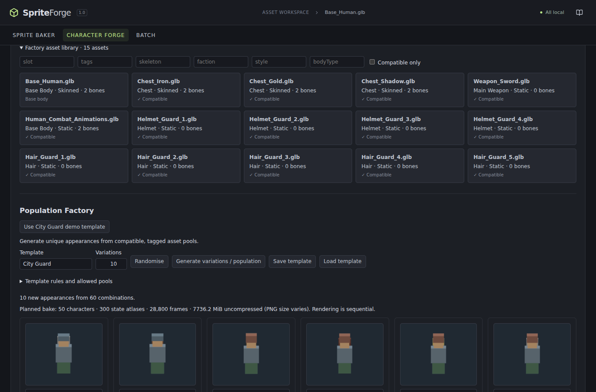

# Modular Character Factory

Open **Character Forge → Modular character factory**. Import a base, modular equipment and optionally a compatible animation GLB. The same preview, mapping, Build, Play test and Send to Unreal actions serve both entry paths.

## Assembly

Slots include Base Body, Head / Face, Hair, Helmet, Chest, Gloves, Legs, Boots, Main Weapon, Offhand, Back and two Accessories. Select an asset in the factory library and edit **Slot** to add a custom slot. Filename/folder heuristics suggest slots such as `Helmet_Iron_01`, `Weapon_Sword_04` and `Boots_Leather_02`; developers can correct them.

Three attachment modes are supported:

- **Shared skeleton:** equipment must have the same named hierarchy, rest transforms and authored bind pose as the base. Its skin is rebound to base bones. Identity attachment XYZ transforms are required. Meshes share animation without creating another animated skeleton.
- **Bone / socket:** attach static equipment to a named base bone. Set XYZ position, Euler rotation in degrees, and positive XYZ scale relative to that bone. Named bones are the supported sockets; game-engine-specific socket definitions are not inferred from GLTF.
- **Fixed transform:** static parts retain their authored source coordinates plus the supplied transform relative to the assembly. Parts are not independently centered or scaled.

Changes rebuild the 3D preview immediately. Incompatibilities explain the expected/found skeleton or missing bone. Equipment is additive: replaceable body regions should be authored as separate meshes or omitted from the base to avoid overlapping geometry. This version does not hide underlying body polygons or retarget arbitrary rigs.

Select an asset in the library to edit tags, faction, art style, developer-defined body type, slot and attachment setup. Those preferences persist locally by content fingerprint. Filters cover those fields, skeleton bone names and current-base compatibility.

## Shared animation libraries

Choose **Shared animation library** to replace base clips. Both ordinary animated GLBs and bone-only animation GLBs are supported. When GLTF has no skin, animated node hierarchies are inspected because loaders may represent its joints as ordinary nodes.

Libraries must match the base hierarchy/rest transforms. Every animation track must address a shared named bone. Root-object transforms, morph-target libraries and universal skeleton retargeting are not supported as shared libraries; a preassembled animated character may still use its own such tracks through the one-click path.

## Loadouts

**Save loadout** writes `Name.spriteforge-character.json`, with `format: "spriteforge-loadout"`, `version: 1`. It stores the character name, base, parts/locks, transforms, animation-library reference, complete state mapping/default and full recipe (including directions, resolution and style).

Source identities are SHA-256 content fingerprints. GLTF fingerprints include declared external buffer/image contents. Files are referenced, not embedded. Keep the source GLBs/GLTF folders with the JSON. On another machine or after a fresh app launch, import the same source files before **Load loadout**. Missing files are reported by their saved names. Loading validates version, unique slots, transforms, recipe and animation mapping before rebuilding.

## Randomisation and templates

Check **Randomise** on the slots to vary. Selected slots can also be **Locked**. The prominent **Randomise** button chooses a compatible unused combination while retaining locked and non-randomised parts.

Template rules support allowed/disallowed tags, faction, style, body type and explicit allowed asset pools per slot. An empty allowed pool means all otherwise-compatible assets in that slot. Rules apply to randomised slots; locked selections are retained and still checked for compatibility. Templates can be saved and loaded as versioned `.template.json` files.

The algorithm shuffles each allowed pool with a seeded PRNG, then walks a bounded mixed-radix index. It never materializes the Cartesian product. Combination signatures prevent duplicates and exhausted pools produce an explanation instead of silently repeating appearances. Duplicate avoidance is scoped to the current randomisation session/variation grid.

## 50-guard demo

1. Click **Try modular Guard demo** in the Character panel. It loads the original skinned body, three chest pieces, four helmets, five hair pieces, a sword and a compatible animation library.
2. In Population Factory click **Use City Guard demo template**. Hair, Helmet and Chest pools provide **60** combinations; the requested count is **50**.
3. Click **Generate variations / population**. Actual assembly thumbnails appear sequentially in a visual grid. Fifty distinct rendered previews are covered by the browser test.
4. Preview a card in 3D, rename it, favourite it, delete it, or expand **Lock selected parts** before rerolling. Select the characters to bake.
5. Review the estimated frames and atlas allocation, choose an NPC bake profile if needed, acknowledge large jobs, and **Bake selected characters** or **Bake all characters**.
6. Completed characters are exported one by one. Desktop asks for an output directory once. Browsers download one ZIP per character and may need permission for multiple downloads. Import their `.character.json` files with the Unreal character importer.

Counts and grids are capped at **200**. Estimated PNG disk size is deliberately not presented as exact; the UI reports raw RGBA atlas size. Large jobs require explicit workload acknowledgement, and export names must be unique after sanitising. Cancel preserves completed exports and previews. Per-character failures remain visible on cards while the queue continues. The most recently completed character remains available to Play test / Send to Unreal.

Changing the base clears the variation grid. Workspace switching preserves it. Per-asset catalog preferences persist locally; the population grid itself is an in-session review surface. Save individual loadouts for durable reusable characters.
