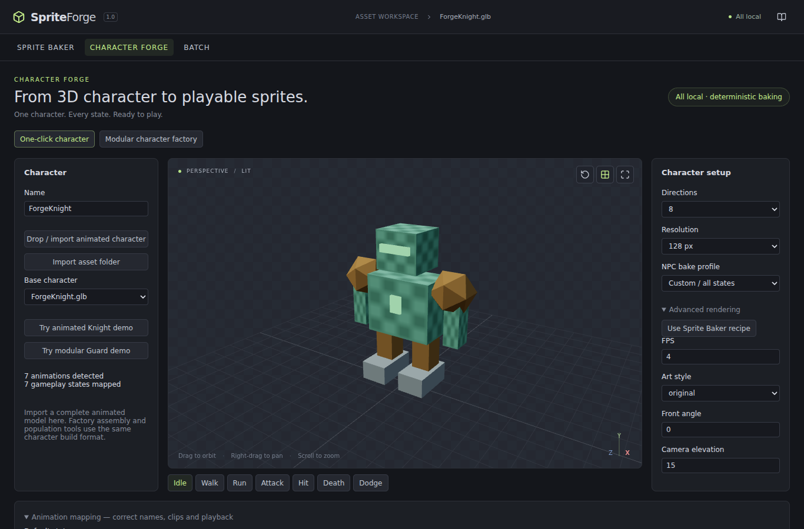
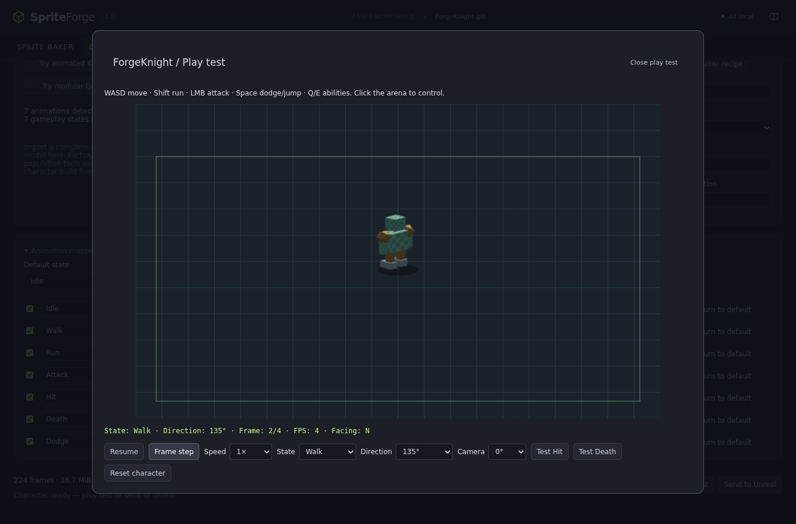

# Character Forge

**Turn an animated 3D model into a playable 2D character — or build an entire population from modular 3D assets.**

Character Forge adds a workspace alongside Sprite Baker and its existing Batch workflow. It reuses the deterministic renderer, art styles, recipes, atlas format and Unreal directional actor. Both imported and assembled characters produce the same versioned character package.

## One-click demo

1. Open **Character Forge → Try animated Knight demo**, or drop/import your animated GLB. For GLTF, import the whole folder with its buffers/textures.
2. The app inspects clips and assigns gameplay states. Defaults are **8 directions, 256 px**, transparent background and ground anchor.
3. Click **Build playable character**. Every included state is baked. The playable preview opens automatically.
4. Focus the arena: **WASD** moves, **Shift** runs, **LMB** attacks, **Space** dodges (or jumps), **Q** plays Ability 1 (or Cast), and **E** plays Ability 2.
5. Close the arena and choose **Send to Unreal**. Desktop writes a fresh output folder; browsers download a ZIP. Extract browser exports before importing.
6. In Unreal, use **Tools → Import SpriteForge Character…**, select the `.character.json`, then drop a `SpriteForgeCharacterExample` into a level and assign the imported Character Asset. See [Unreal integration](UNREAL_INTEGRATION.md).

## Mapping and rendering

Clip-name classification is deterministic and editable: `Idle_01 → Idle`, `Walk_Fwd → Walk`, `Jog → Run`, `SwordAttack_A/B → Attack / Attack 2`, `DamageReact → Hit`, `Death_A → Death`, `Cast_Spell → Cast`. Unknown names become custom states. Ambiguous heuristics should be corrected by the developer.

The mapping editor can change names, choose another clip, exclude states, select the default and set loop/return behaviour. Names must be unique, start with a letter, use letters/numbers/spaces/underscore/hyphen, and fit 64 characters. Gameplay controls recognize the canonical state names shown above; custom states are available in the preview state selector and Unreal `SetState` API.

Idle/Walk/Run/Block loop by default. Attack/Hit/Death/Dodge/Cast are one-shots. Death holds its final frame. Other one-shots return to the default unless disabled. A one-shot used as the default itself holds at the end. Missing movement animations fall back to an available locomotion state, then to the character default; unavailable optional actions do nothing.

Directions: **4 / 8 / 16**. Resolution: **128 / 256 / 512 / 1024**. Advanced controls include FPS, eight existing art styles, front angle, camera elevation and **Use Sprite Baker recipe** for the full existing rendering configuration. Ground anchoring and transparent output are enforced for character packages.

All selected clips are sampled at explicit times and measured into one bounds union before rendering. This makes scale, framing and the ground pivot identical across every state and direction. The original model's root motion is preserved in the sprites; use in-place animation assets for conventional stationary-cell locomotion. Universal retargeting and root-motion extraction are outside this version.

## Playable preview

The arena draws rectangles from the actual exported atlas PNGs; it does not render the source 3D model. It selects the nearest direction from camera yaw minus character heading plus the exported front convention.

The debug line shows state, direction, frame, FPS and facing. Controls include pause/resume, 0.25× speed, one-frame stepping, manual state selection, direction lock, camera yaw, Test Hit, Test Death and Reset Character. Keyboard input belongs to the focused arena and is cleared on blur.

## NPC bake profiles

| Profile | States | Directions | Cell |
| --- | --- | --- | --- |
| Background Civilian | Idle, Walk | 8 | 128 |
| Standard NPC | Idle, Walk, Run, Hit | 8 | 256 |
| Combat NPC | Idle, Walk, Run, Attack, Hit, Death | 8 | 256 |
| Hero / Boss | All mapped | 16 | 512 |

Profiles select available states; they do not invent missing animations. The estimate catches individual atlases that exceed existing limits before rendering.

## Workload and output

The app displays exact frame counts from `ceil(clipDuration × FPS) × directions`, summed over enabled states and multiplied by character count. Atlas dimensions include padding and optional power-of-two rounding. Displayed MiB is **uncompressed RGBA atlas allocation**, not a prediction of PNG compression. Large jobs (more than 10,000 frames or 512 MiB of atlas allocation) require acknowledgement.

Existing limits remain: 4,096 samples per clip, 8,192 frames per atlas, 8,192 px per side, and 32 megapixels per atlas. A character supports up to 256 states. Lower FPS/resolution/directions or split long clips when a state exceeds those limits.

One loaded assembly is reused throughout a character build. Frames are written directly to its atlas canvas; full-resolution individual-frame PNGs are not retained by Character Forge. Completed atlases are retained for play/export. Rendering is sequential and cancellable, with GPU resources released after each state. Population jobs export each completed character before proceeding.

See [Character Factory](CHARACTER_FACTORY.md) for assembly/populations and [Character metadata](CHARACTER_METADATA.md) for the package contract.
